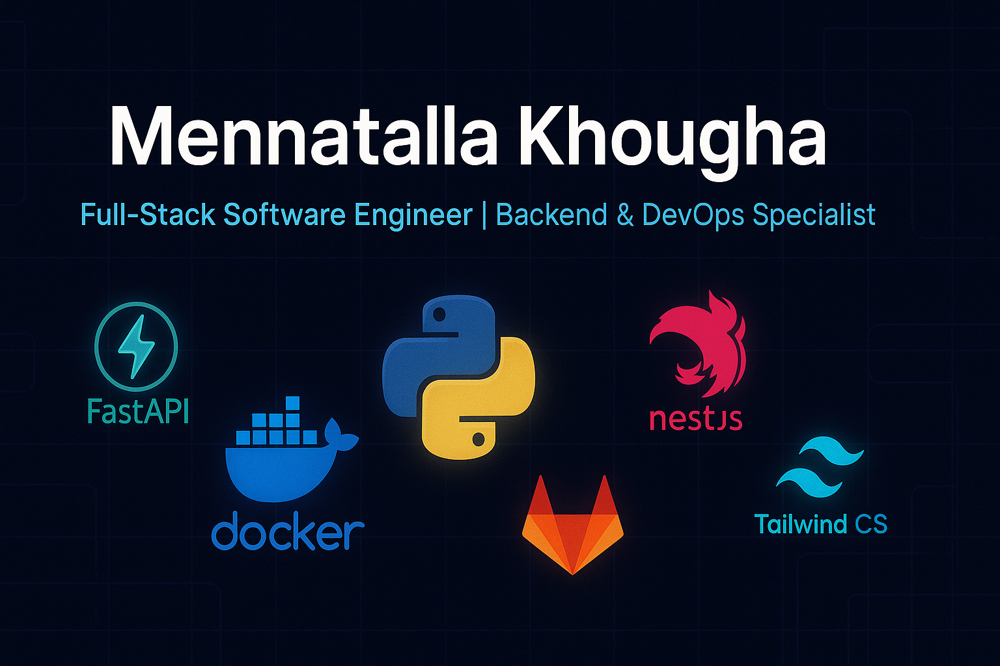

  

# 👋 Hi, I'm Mennatalla Khougha

🚀 **Software Engineer | Full-Stack (Backend & DevOps Focus)**  
Crafting reliable systems with **Python/FastAPI**, automating with **CI/CD**, and deploying on **Docker/Linux**.  
I build fast, reliable systems — with a strong focus on **backend performance** and **DevOps automation** — while staying versatile enough to deliver clean and functional **front-end experiences** when needed.  

---

## 💡 About Me
- 🔧 Backend specialist with strong **DevOps** background (CI/CD pipelines, Docker Compose, Nginx, SSL/TLS).  
- ⚡ Optimized FastAPI + Firestore + Redis API from **48s → <2s creates** and **sub-second reads**.  
- 📦 Experienced in Frappe/ERPNext customization, automation, and secure deployments.  
- 🌍 Open to freelance/remote engineering collaborations.  
- 🥋 Fun fact: I was a karate coach for 10+ years, mentoring 1,000+ athletes!  

---

## 🛠️ Tech Stack

**Languages:** Python, C, JavaScript, TypeScript, SQL  
**Backend:** FastAPI, Django, Flask, Frappe, NestJS, Express  
**Frontend:** React, Next.js, shadcn/ui, Tailwind CSS  
**Databases:** MySQL, MariaDB, MongoDB, Firestore  
**DevOps & Tools:** Linux, Docker, Docker Compose, GitLab CI, GitHub Actions, Nginx, OpenSSL  
**Other:** SQLAlchemy, Prisma, Redis  

---

## 🚀 Highlight Projects

- **[Roadmaps API](https://medium.com/@menmen.khougha/learning-fastapi-firestore-radis-a-backend-journey-with-more-bugs-than-features-wip-15d103954e70)**  
  *FastAPI + Firestore + Redis*  
  - Designed scalable backend for roadmap/task management.  
  - Reduced API latency from **48s → <2s** with caching + async.  
  - JWT auth, CI/CD pipeline, and Dockerized setup.  

- **LCK (Role-Playing Game)** *(Next.js + NestJS + Redux + MongoDB)*  
  Interactive role-playing game where players choose genres and progress through dynamic stories.  
  - Implemented gameplay flow and state management.  
  - Integrated AI-generated story and visuals.  
  - Achieved **96% positive feedback** on creativity and experience.   

- **ALXHIBIT**  
  *Next.js + Prisma + MongoDB*  
  - Project gallery platform for showcasing, rating, and connecting.  
  - Improved retention by **+25%** with interactive features.  

- **Doodles**  
  *Next.js + Prisma + MongoDB*  
  - Drawing-sharing app with responsive UI.  
  - Increased engagement by **+30%**.  

---

## 📊 GitHub Stats

  
  

---

## 🌐 Connect With Me

- 💼 [LinkedIn](https://www.linkedin.com/in/khougha/)  
- 🌎 [Portfolio](https://mennatalla-khougha.vercel.app/)  
- ✍️ [Medium](https://medium.com/@menmen.khougha)  
- 📧 [Email](mailto:mkhougha@gmail.com)  

---

✨ _“Code is like karate — practice, discipline, and focus turn small moves into powerful results.”_ ✨
